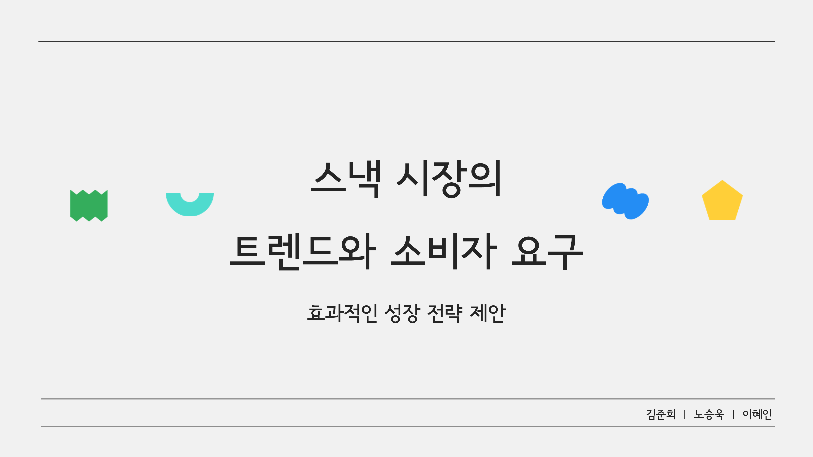

# 스낵 시장 분석 프로젝트

  <h2> <strong>프로젝트 표지</strong> </h2>

 

  <h2><strong>발표자료</strong></h2>

<ul>
  <li><a href="세미프로젝트.pdf">스낵 시장 분석 프로젝트 자료</a></li>
</ul>

 

  <h2><strong>프로젝트 개요</strong></h2>
  스낵 시장의 트렌드와 소비자 요구를 주제로 한 프로젝트입니다. 
  크롤링, 워드클라우드, 시계열 분석 등을 활용하여 데이터 분석을 진행하였습니다. 

 

  <h2><strong>🛠 사용 기술 스택</strong></h2>
  <ul>
    <li><strong>언어</strong> : Python </li>
    <li><strong>분석 기법 </strong>: 
      <ul>  
        <li>SARIMA</li>
        <li>grangercausalitytests</li>
      </ul>
  </li>
    <li><strong>시각화</strong> : matplotlib</li>
  </ul>

 

  <h2><strong>프로젝트 내용</strong></h2>
  <ul>
    <li><strong>1.주제 선정</strong>
      <ul>
        <li>사람들이 접하기 쉽고 친숙한 스낵 시장의 동향을 파악</li>
      </ul>
    </li>
     
    <li><strong>2.데이터 설명</strong>
      <ul>
        <li><strong>활용 데이터:</strong>
          <ul>
            <li>연도별 제조사, 상품, 카테고리별 과자 매출액</li>
            <li>평가 데이터(리뷰 데이터, 언급량 데이터)</li>
          </ul>
        </li>
         
        <li><strong>데이터 수집 출처:</strong>
          <ul>
            <li>FIS 식품산업통계정보</li>
            <li>KOSIS 국가통계포털</li>
            <li>신세계 닷컴, 마켓 컬리</li>
            <li>네이버 블로그</li>
          </ul>
        </li>
      </ul>
    </li>
     
    <li><strong>3.데이터 분석</strong>
      <ul>
          <li>SARIMA를 활용하여 현 스낵 시장을 예측</li>
          <li>크롤링, 워드클라우드, 그랜저 인과성 테스트 등을 통하여 매출액과의 연관성을 확인</li>
      </ul>
    </li>
     
    <li><strong>4.성장 전략 제안</strong>
      <ul>
        <li>긍정적인 소비자 인식 구축</li>
        <li>소비자의 호기심을 자극</li>
        <li>선택 기준을 반영한 소비자 맞춤형 마케팅 전략</li>
        <li>미투 제품 및 트렌드를 반영한 제품 개발</li>
      </ul>
    </li>
  </ul>

 

  <h2><strong>한계점</strong></h2>
  <ul>
    <li>데이터의 한계점</li>
      <ul>
        <li>데이터 기간이 한정적</li>
        <li>상세 스낵별 매출액 부족</li>
        <li>제품의 정보 부족</li>
      </ul>
     
    <li>소비자 리뷰의 한계점</li>
      <ul>
        <li>리뷰 수 부족</li>
        <li>리뷰 내용의 빈약성</li>
        <li>한글 언어 표현의 다양성</li>
        <li>트렌드 제품 리뷰 수집</li>
      </ul>
  </ul>

